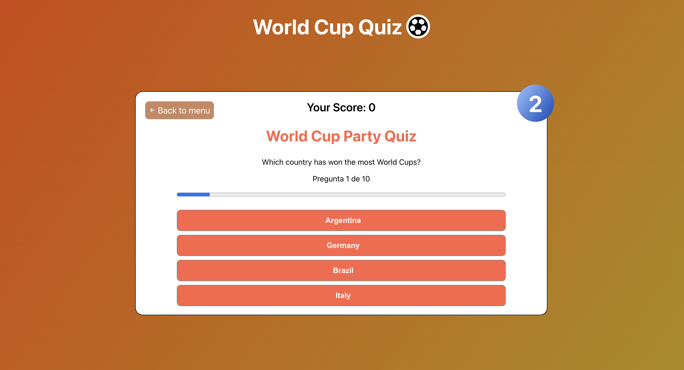

# World Cup Quiz App

 <!-- Replace with the actual path to the image -->

Welcome to the **World Cup Quiz App**! This application is designed to test your knowledge about the World Cup, the world's most popular football tournament. The quiz covers various aspects of the tournament, including historical moments, player statistics, and general trivia. It’s a fun and engaging way to learn more about the World Cup.

This project is part of a monthly challenge hosted by [mouredev](https://github.com/mouredev/Monthly-App-Challenge-2022?tab=readme-ov-file#febrero-030222). Feel free to check out other exciting projects and challenges on the mouredev repository.

## Table of Contents

- [Features](#features)
- [Installation](#installation)
- [Usage](#usage)
- [Screenshots](#screenshots)
- [Acknowledgments](#acknowledgments)

## Features

- **Multiple Choice Questions:** Answer questions with multiple choices.
- **Leaderboard:** Compare your scores with other users globally.

## Installation

To get started with the World Cup Quiz App, follow these steps:

1. **Clone the repository:**
   ```bash
   git clone https://github.com/Nachocisss/soccerQuiz
   ```
2. **Navigate to the project directory:**
   ```bash
   cd world-cup-quiz-app
   ```
3. **Install the dependencies:**
   ```bash
   npm install
   ```
4. **Start the application:**
   ```bash
   npm start
   ```

## Usage

1. Open your web browser and navigate to `http://localhost:3000` to access the app.
2. Start the game or choose High Scores Board
3. Answer the questions within the time limit.
4. Submit your answers and check your score.

## Screenshots

### Quiz Interface



### HighScores


### EndGame


## Acknowledgments

- Special thanks to [mouredev](https://github.com/mouredev) for the inspiration and challenge.

---

[Back to Top](#world-cup-quiz-app)

---

### Additional Resources

- [mouredev Monthly Challenges](https://github.com/mouredev/Monthly-App-Challenge-2022)
- [React Documentation](https://reactjs.org/docs/getting-started.html)

---

Made with ❤️ by [Nachociss](https://github.com/Nachocisss).
